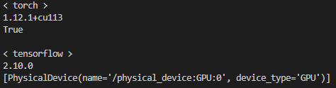

# Tensorflow, Pytorch, ONNX and TensorRT convert
-------

>Environment

|Name|Version|
|:---:|:---:|
|IDLE|Conda - VS code| 
|OS|Windows 10|
|Python|3.10|
|CUDA|11.3|
|cudnn|8.6.0|
|Tensorflow|2.10.0|
|Pytorch|1.12|
|ONNX|1.12.0|
|onnxruntime|1.13|
|TensorRT|8.5.1.7|
|opencv|4.6.0|
|Computer|Notebook|
|GPU|GTX 1650ti|

------
>Setup Environment
>>1. install anaconda3
>>2. install vscode
>>3. make virtualenv python-3.10 in conda
>>4. install cuda 11.3
>>5. install cudnn 8.6.0
>>6. Reboot

-------
>Install library
>>1. pytorch<br>
>>```python pip install torch==1.12.1+cu113 torchvision==0.13.1+cu113 torchaudio==0.12.1 --extra-index-url https://download.pytorch.org/whl/cu113```<br>
>>```pip install pytorch_model_summary```<br>
>>
>>2. tensorflow<br>
>>```pip install tensorflow==2.10.0```<br>
>>
>>3. check gpu available<br>
>>```python gpu_test.py```<br>
>></img>
>>
>>4. opencv-python<br>
>>```pip install opencv-python```<br>
>>
>>5. onnxruntime<br>
>>```pip install onnxruntime```<br>
>>
>>6. tf2onnx<br>
>> download tf2onnx : [download](https://github.com/onnx/tensorflow-onnx)<br>
>>```pip install -U tf2onnx```<br>
>>
>>7. tensorRT<br>
>> download tensorRT : [download](https://developer.nvidia.com/nvidia-tensorrt-8x-download)<br>
>>```unzip download file```<br>
>>```move TensorRT-8.5.1.7 directory to C:\```<br>
>>```pip install <tensorrt_install_dir>/python/tensorrt-8.x.x.x-cp<python_ver>-none-linux_x86_64.whl```<br>
>>```( in my case : C:\TensorRT-8.5.1.7\python\tensorrt-8.5.1.7-cp310-none-win_amd64.whl )```<br>
>>```add environment path TensorRT-8.5.1.7\lib  ( in my case : C:\TensorRT-8.5.1.7\lib )```<br>
>></img><br>
>></img><br>
>></img><br>
>>```Reboot```<br>
>>
>>8. download zlibwapi.dll<br>
>> download zlibwapi.dll : [download]https://docs.nvidia.com/deeplearning/cudnn/install-guide/index.html#install-zlib-windows)<br>
>>```move zlibwapi.dll to C:\Program Files\NVIDIA GPU Computing Toolkit\CUDA\v11.3\bin\```<br>
>>
>>9. install pycuda<br>
>>```pip install pycuda```<br>
>>
>>10. make .trt model<br>
>>```open command```<br>
>>```( onnx_torch )C:\TensorRT-8.5.1.7\bin\trtexec  --onnx=vgg_torch.onnx --saveEngine=vgg_torch.trt```<br>
>>```( onnx_tf )C:\TensorRT-8.5.1.7\bin\trtexec  --onnx=vgg_tf.onnx --saveEngine=vgg_tf.trt```<br>

------
now, You can use tensorRT.<br>
```python compare_time.py```


|Env|100 inference Time(sec)|
|:---:|:---:|
|Pytorch|5.16 sec| 
|Pytorch-ONNX|9.22 sec| 
|Pytorch-TensorRT|1.01 sec| 
|Tensorflow|4.39 sec| 
|Tensorflow-ONNX|11.62 sec| 
|Tensorflow-TensorRT|1.10 sec| 